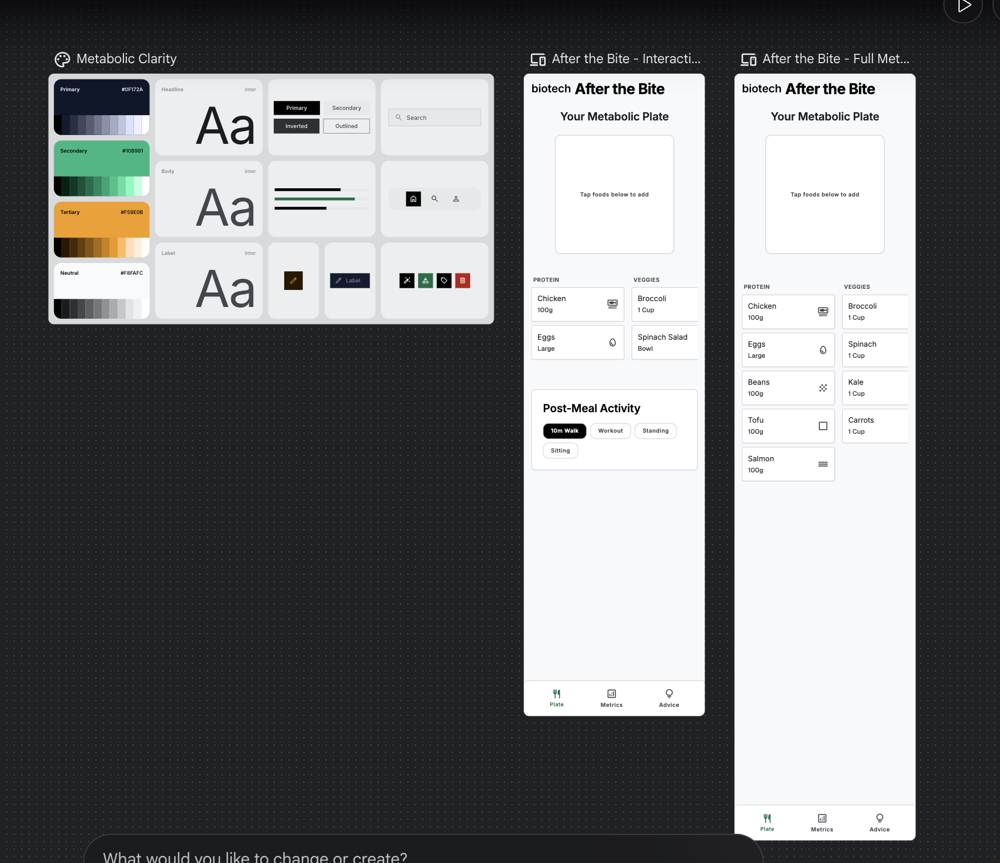
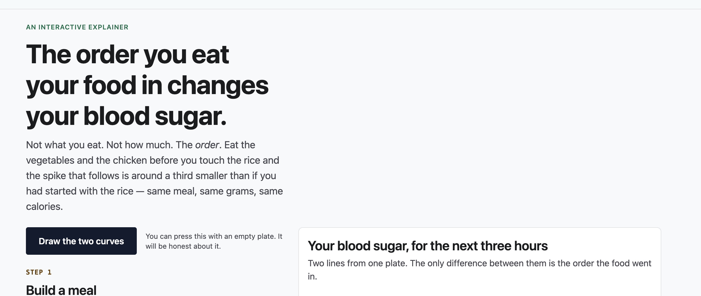
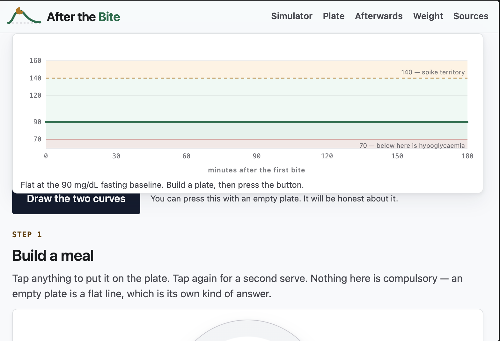

# Process overview

## What I built

**After the Bite** is an interactive explainer for one claim: the order you eat
your food in changes your blood sugar. You build a plate from 78 foods, choose
what you do for the two hours afterwards, and the page draws two glucose curves
from that single plate, one where the protein and vegetables go in first, one
where the carbohydrate does. Same food, same grams, same calories, different
curve. It is to show the users the effects of the smallest choices they make.

## The moments that mattered

### The colour palette

I used Stitch to design my palette and added those instructions to DESIGN.md.
This helped me decide the colours for dark mode without making a few colours
disappear, and gave the webpage its format
([`bb800f1...145b270`](https://github.com/comp4020-agentic-coding-studio/comp4020-ass1-rithikanallaparaju16/compare/bb800f1...145b270)).

So using Stitch, first I explained my project to it, and then I asked Stitch to
generate a palette, which I used in this assignment.

### Research mistakes

Banana was noted as good fibre and good to consume before a meal, but when you
eat a banana the carbs are absorbed and there is a spike. Claude considered
banana to be a good source to start your meal with. Due to this I changed
CLAUDE.md to check resources well before adding any data. So from then the
information is checked and trusted better.

I also made most of the project transparent — for example the calculation of
grams of food, protein, etc. The sources are also visible for the users to
directly check the evidence
([`5aebed3`](https://github.com/comp4020-agentic-coding-studio/comp4020-ass1-rithikanallaparaju16/commit/5aebed3)).

### Basic checking

For no errors, I gave it a range of glucose values in CLAUDE.md, so whenever the
code misbehaves the agent can easily detect it and make the changes.

This was done for quality checking: any value below the specified minimum (70)
means the calculations were wrong and we have to recalculate. These constraints
help the site self-check and minimise errors
([`5aebed3...1b828ce`](https://github.com/comp4020-agentic-coding-studio/comp4020-ass1-rithikanallaparaju16/compare/5aebed3...1b828ce)).

### Layout on the phone

I gave it proper instructions for the phone navigation bar (burger). I used the
"inspect" option to check how the website looks on a phone: it has a good flow,
but the navigation bar looked congested and did not look user friendly. So I made
it follow the 3-line pattern — when we click on that the menu opens, otherwise
the menu stays collapsed.

I also made some layout changes along the way to make the user experience better,
so I installed Playwright and made Claude use it to understand the layout better.

Making it measure the render rather than look at it found the causes: a stale SVG
width was propping the grid to 976px inside a 768px window, and there was 291px
of dead column where the short food library sat beside the tall meal card
([`145b270...8559a4d`](https://github.com/comp4020-agentic-coding-studio/comp4020-ass1-rithikanallaparaju16/compare/145b270...8559a4d)).
